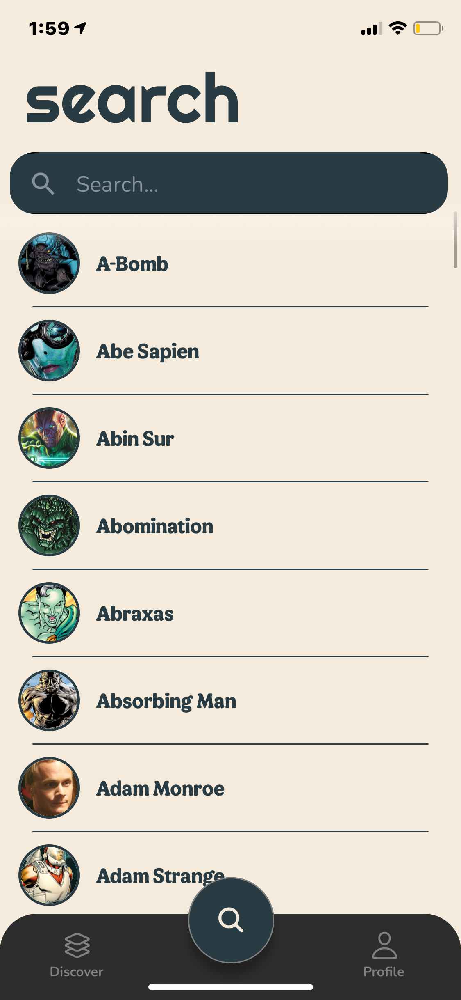

<div align="center">


</div>

<h1 align="center">🦸‍♂️ Superhero Encyclopedia 🦸‍♀️</h1>

<p align="center"> Made in React Native, constructed with Expo CLI, utilizing the superheroAPI and ComicVine API. </p>
<p align="center">
  
  <a href="#" target="_blank">
    
  </a>
    <a href="#" target="_blank">
    
  </a>
  <a href="#" target="_blank">
    
  </a>
  <a href="https://twitter.com/mrginolee" target="_blank">
    
  </a>
</p>

<!-- <h2 align="center">☀️ <a href="https://ginoleeswan.github.io/weather-app-basic/">See Live</a> ☀️</h2> -->

<p align="center">

  
  
  
  

</p>

<h2 align="right">📖 &nbsp; Lessons Learned</h2>

<div align="right">

&nbsp; My first React Native project!\
&nbsp; The main focus here was to make **external API calls** to pull superhero infomation from a third party site.

</div>

## 🔮 &nbsp; Future Features

- 📊 &nbsp; Stats Graph
- 🎥 &nbsp; List of Movies
- 📅 &nbsp; Timeline of Appearances
- 🎞 &nbsp; Streaming Links

<h2 align="right">🚀 &nbsp; Deployment</h2>
<div align="right">

No current Deployment

<!-- Deployed with [Github Pages](https://ginoleeswan.github.io/weather-app-basic/) -->

</div>

## 🔨 &nbsp; Get Started

From your command line, first clone this repo:

```sh
# Clone this repository
$ git clone https://github.com/ginoleeswan/hero

# Go into the repository
$ cd hero

# Remove current origin repository
$ git remote remove origin
```

### 💻 &nbsp; Install

First you need to install Nodejs and npm, this is different depending on the OS you are running so it is easier to check the node [page](https://nodejs.org/en/download/)

Install [expo](https://expo.io/learn), if it fails run you might need to run this with sudo

```sh
npm install expo-cli --global
```

Install the needed packages while in the root folder of the project

```sh
npm install
```

### 📱 &nbsp; Usage

To Start expo all you have to do is run this line

```sh
expo start
```

<div align="right">

## ✍️ &nbsp; Author

👤 **Gino Swanepoel**

&nbsp; Twitter: [@mrginolee](https://twitter.com/mrginolee)\
 &nbsp; Github: [@ginoleeswan](https://github.com/ginoleeswan)\
 &nbsp; LinkedIn: [@ginoswanepoel](https://linkedin.com/in/ginoswanepoel)

</div>

## ❤️ &nbsp; Show your support

Give a ⭐️ if this project helped you!
