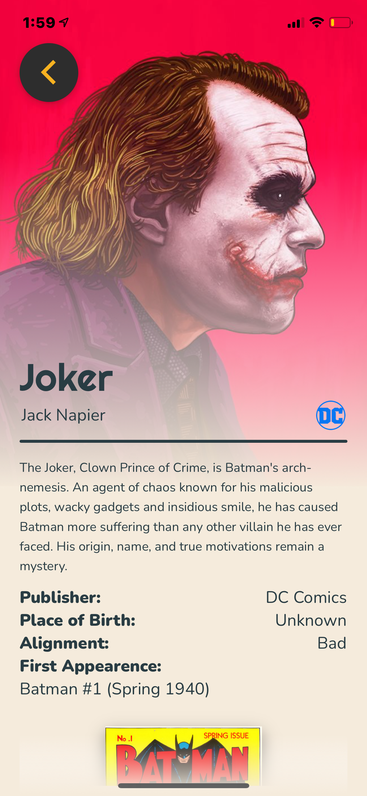
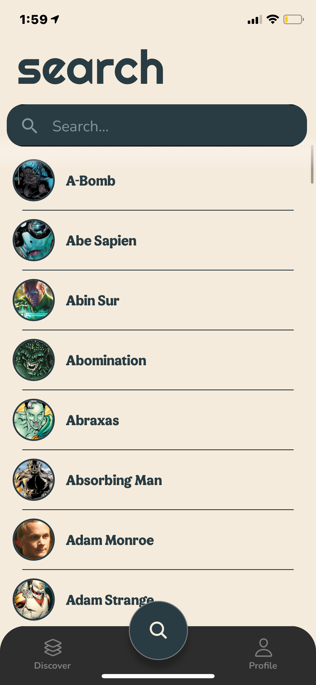

<div align="center">


<h1>🦸‍♂️ Superhero Encyclopedia 🦸‍♀️</h1>

<p>A superhero encyclopedia app built with Expo and React Native, targeting iOS, Android, and Web.</p>

<p>
  
  <a href="#"></a>
  <a href="#"></a>
  <a href="#"></a>
  <a href="https://twitter.com/mrginolee"></a>
</p>

<p>
  
  
  
  
</p>

</div>

## Tech Stack

| Concern | Library |
|---|---|
| Navigation | expo-router 4 (file-based) |
| Auth + DB | Supabase |
| External APIs | SuperheroAPI, ComicVine API |
| Animations | react-native-reanimated 4 |
| Carousel | react-native-reanimated-carousel |
| Card shape | react-native-figma-squircle |
| Testing | jest-expo + @testing-library/react-native |

## Get Started

Requires [Node.js](https://nodejs.org/en/download/) and [Yarn](https://yarnpkg.com/).

```sh
git clone https://github.com/ginoleeswan/hero
cd hero
yarn install
```

Copy `.env.example` to `.env.local` and fill in your keys:

```sh
cp .env.example .env.local
```

| Variable | Description |
|---|---|
| `EXPO_PUBLIC_SUPABASE_URL` | Supabase project URL |
| `EXPO_PUBLIC_SUPABASE_KEY` | Supabase anon key |
| `SUPABASE_SERVICE_ROLE_KEY` | Supabase service role key (server-side only) |
| `SUPERHERO_API_KEY` | [SuperheroAPI](https://superheroapi.com/) key |
| `COMICVINE_API_KEY` | [ComicVine API](https://comicvine.gamespot.com/api/) key |
| `EXPO_PUBLIC_GOOGLE_WEB_CLIENT_ID` | Google OAuth web client ID |
| `EXPO_PUBLIC_GOOGLE_IOS_CLIENT_ID` | Google OAuth iOS client ID |

Then start the dev server:

```sh
yarn start
```

Run tests:

```sh
yarn test:ci
```

## Author

👤 **Gino Swanepoel** &nbsp; [Twitter](https://twitter.com/mrginolee) · [GitHub](https://github.com/ginoleeswan) · [LinkedIn](https://linkedin.com/in/ginoswanepoel)

## ❤️ Show your support

Give a ⭐️ if this project helped you!
