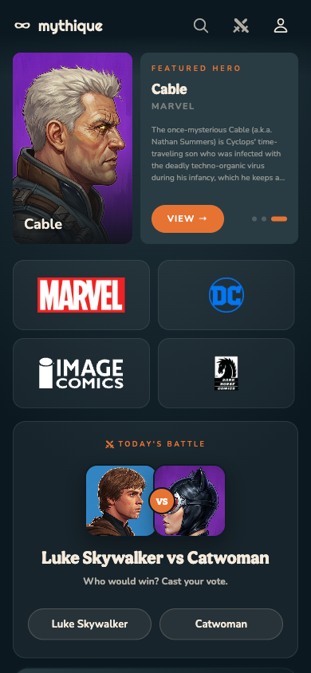
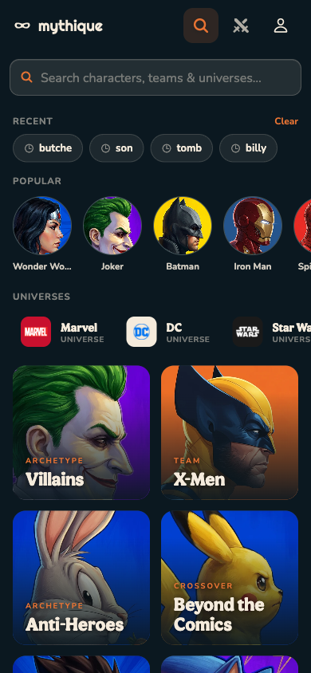
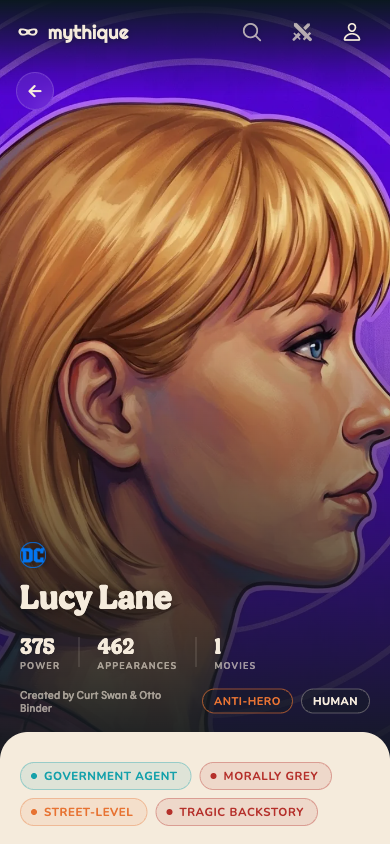
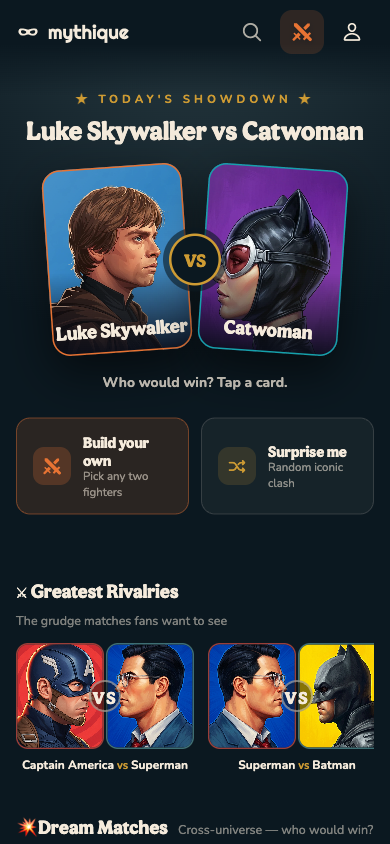

<div align="center">

<picture>
  <source media="(prefers-color-scheme: dark)" srcset="./assets/mythique-logo.svg" />
  
</picture>

<h1>Mythique</h1>

<p><strong>A cinematic encyclopedia of every hero &amp; villain.</strong><br/>
34,000+ characters across every universe — battles, rivalries, comics &amp; movies — on iOS, Android &amp; Web.</p>

<p>
  
  
  
  
  
  
  
</p>

<p>
  
  
  <a href="#"></a>
  <a href="https://twitter.com/mrginolee"></a>
</p>

<br/>

<table>
  <tr>
    <td align="center" width="25%"><br/><sub><b>Explore</b><br/>featured hero &amp; daily battle</sub></td>
    <td align="center" width="25%"><br/><sub><b>Search</b><br/>popular, universes &amp; archetypes</sub></td>
    <td align="center" width="25%"><br/><sub><b>Character</b><br/>art, power stats &amp; traits</sub></td>
    <td align="center" width="25%"><br/><sub><b>Arena</b><br/>vote on who would win</sub></td>
  </tr>
</table>

</div>

## ✨ Features

- 🦸 **Explore feed** — featured hero spotlight, on-screen-now titles, new comics, biggest movers &amp; "on this day" history, all curated from Supabase.
- ⚔️ **The Arena** — daily 1-v-1 matchups and team battles. Cast your vote on "who would win?"
- 🏛️ **Hall of Fame &amp; Universes** — browse by publisher (Marvel, DC, Image…), archetype, and franchise; fame-ranked by a mainstream-recognizability score, not raw issue counts.
- 🔎 **Unified search** — one query, instant results across the whole catalogue from a nav palette or full page.
- 📊 **Character detail** — power stats, biography, comic-cover gallery, first appearance, allies/enemies/rivals, and movie/TV appearances.
- 🆚 **Compare** — put any two characters head-to-head.
- 👤 **Profiles &amp; favourites** — sign in with Google to save heroes, vote, and track your streak.
- 🌐 **Truly universal** — one codebase ships native iOS/Android and a polished web app.

## 🧰 Tech Stack

| Concern | Library |
| --- | --- |
| Navigation | expo-router 4 (file-based) |
| Auth + DB | Supabase (Postgres + RLS, `@supabase/supabase-js`) |
| Data layer | TanStack React Query |
| External APIs | SuperheroAPI, ComicVine, TMDB, Wikidata |
| Images | expo-image (+ BlurHash LQIP placeholders) |
| Animations | react-native-reanimated 4 |
| Carousel | react-native-reanimated-carousel |
| Card shape | react-native-figma-squircle + masked-view |
| Icons / Fonts | @expo/vector-icons · Nunito / Righteous / custom Flame |
| Testing | jest-expo + @testing-library/react-native |

## 🗺️ Architecture

A thin view layer over a hooks-and-query data core. Screens never touch Supabase directly.

| Concern | Path |
| --- | --- |
| Screens / routes | `app/` (expo-router file-based) |
| Reusable hooks | `src/hooks/` |
| React Query data + cache | `src/lib/query/` |
| DB access (per-table) | `src/lib/db/` |
| External REST APIs | `src/lib/api.ts` |
| UI components | `src/components/` |
| Types | `src/types/index.ts` (app) · `database.generated.ts` (generated) |
| SQL migrations | `supabase/migrations/` |

> Screens with a web variant (`foo.web.tsx`) stay thin — shared data lives in a platform-neutral hook in `src/hooks/`.

## 🚀 Get Started

Requires [Node.js](https://nodejs.org/en/download/) and [Yarn](https://yarnpkg.com/) (the only supported package manager).

```sh
git clone https://github.com/ginoleeswan/hero
cd hero
yarn install
cp .env.example .env.local   # then fill in your keys (below)
yarn start                   # dev server
```

## 🔑 Environment

| Variable | Description |
| --- | --- |
| `EXPO_PUBLIC_SUPABASE_URL` | Supabase project URL |
| `EXPO_PUBLIC_SUPABASE_KEY` | Supabase anon key |
| `SUPABASE_SERVICE_ROLE_KEY` | Supabase service role key (server-side only) |
| `SUPERHERO_API_KEY` | [SuperheroAPI](https://superheroapi.com/) key |
| `COMICVINE_API_KEY` | [ComicVine API](https://comicvine.gamespot.com/api/) key |
| `EXPO_PUBLIC_GOOGLE_WEB_CLIENT_ID` | Google OAuth web client ID |
| `EXPO_PUBLIC_GOOGLE_IOS_CLIENT_ID` | Google OAuth iOS client ID |

> `EXPO_PUBLIC_*` vars are inlined by Metro at build time — never read them via `expo-constants`.

## 📜 Scripts

| Command | What it does |
| --- | --- |
| `yarn start` | Start the Expo dev server |
| `yarn ios` / `yarn android` | Build &amp; run a native dev client |
| `yarn web` | Run the web app |
| `yarn test:ci` | Run the test suite once (CI mode) |
| `yarn typecheck` | `tsc --noEmit` |
| `yarn lint` | ESLint (errors-only gate) |
| `yarn format` | Prettier write |

## 👤 Author

**Gino Swanepoel** &nbsp; · &nbsp; [Twitter](https://twitter.com/mrginolee) · [GitHub](https://github.com/ginoleeswan) · [LinkedIn](https://linkedin.com/in/ginoswanepoel)

## ❤️ Show your support

Give a ⭐️ if Mythique helped you — and see [`CODE_OF_CONDUCT.md`](./CODE_OF_CONDUCT.md) before contributing.
